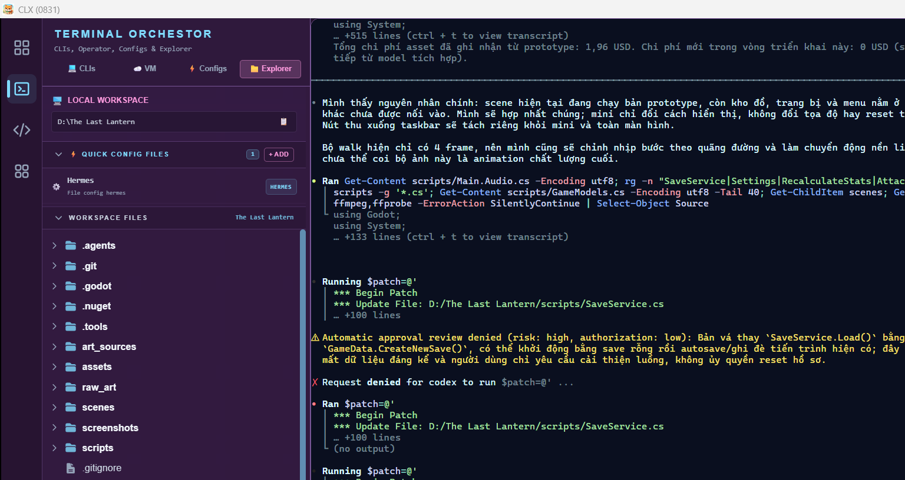
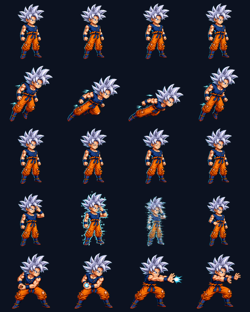
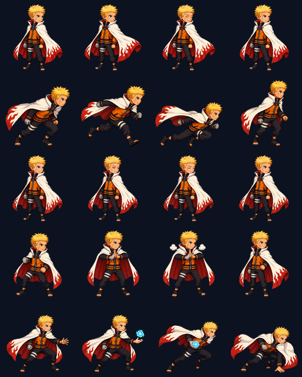
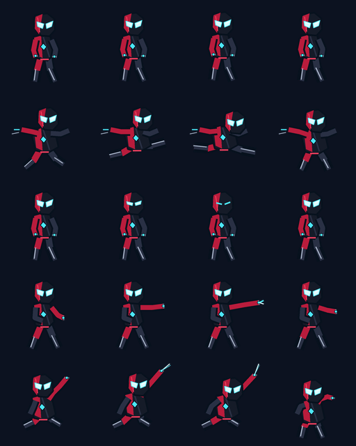

# CLX — CLI Orchestrator

CLX is a high-performance desktop workspace for running and orchestrating
multiple AI CLI tools. It combines real pseudo-terminal sessions, project-aware
file navigation, an AI companion, proxy tooling, remote workflows, and optional
animated desktop pets in one multi-tabbed Tauri application.

Unlike a command wrapper, CLX provides a full PTY environment for interactive
tools such as `aider`, `claude-code`, and `gemini-cli`, while preserving native
terminal behavior and long-running sessions.



## 🚀 Key Features

- **Multi-Session Interactive Terminal**: Run multiple interactive CLI sessions simultaneously using a robust XTerm.js-powered UI and a Rust-based PTY backend.
- **Smart Ctrl+C / Ctrl+V Support**: Seamlessly copy selected terminal text or paste text from the system clipboard directly into PTY sessions.
- **Built-in AI Companion**: 
  - Chat with a custom LLM right from the sidebar!
  - Fully customizable: support OpenAI-compatible custom endpoints, custom models, custom API keys, custom headers (e.g. customized `User-Agent`), custom System Prompt, and toggleable **Stream Mode**.
  - History is preserved locally across app restarts.
- **Cyberpunk Resizable Sidebar**: Resize the VSCode-style sidebar by clicking and dragging with the mouse. Width is automatically persisted.
- **Auto-focused Explorer Workspace**: Switching between active PTY sessions automatically focuses the File Explorer tab, loads the corresponding session's working directory, and updates the workspace view seamlessly.
- **Interactive File Actions**: Click files in the Explorer tree to instantly send their paths to the active PTY session (or copy to clipboard silently if no active session is selected) with reactive Anime Assistant status feedback (no annoying system confirm/alert popups).
- **Tab Layout Optimization**: Reorganized control panel with session tabs, "Save Tag", and "Stop" actions housed in a clean sticky bottom Footer, maximizing terminal output area.
- **Dynamic CLI Registration**: Add any CLI tool by simply defining a JSON configuration.
- **Smart Directory Management**: Save and quickly select working directories for your projects. Tags are automatically associated with paths for seamless context switching.
- **Animated Desktop Pets**:
  - Keep the four built-in mythical pets or import private local pet packs.
  - Preview idle, travel, blink, and signature moves without interrupting the live overlay.
  - Configure size and speed independently for every pet.
  - Click the live pet to open the AI surface.
- **Premium Aesthetics**: Choose between **Cyberpunk**, **Kawaii**, and light themes with configurable companion overlays.

## ✨ Animated Pets

The current private showcase pack contains three 128×128 chibi animation sets.
Every character includes idle, travel, blink, and two bounded special moves.
The full runtime pack remains local-only and is not bundled into the
application.

<table>
  <tr>
    <td align="center">
      
      <br><strong>Goku Ultra Instinct</strong>
      <br><sub>Instant Transmission · Kamehameha</sub>
    </td>
    <td align="center">
      
      <br><strong>Naruto Seventh Hokage</strong>
      <br><sub>Shadow Clone Jutsu · Rasengan</sub>
    </td>
    <td align="center">
      
      <br><strong>Web Ranger</strong>
      <br><sub>Web Shot · Web Zip</sub>
    </td>
  </tr>
</table>

Web Ranger is an original arachnid-themed character. It is not represented as
Spider-Man and does not use Spider-Man logos or movie suit artwork.

### Pet controls

Open **Settings → Animated Pets** to:

- Enable or disable the live pet overlay.
- Select a built-in or imported pet.
- Import a folder containing `manifest.json`.
- Enable automatic non-repeating special moves.
- Preview every animation on an isolated 320×220 stage.
- Tune each pet from `20–160px` and `0.5×–2.0×` speed.
- Reset one pet to its manifest or built-in defaults.

Per-pet overrides are saved locally under `clx-mythical-pet-tuning`. The
showcase pack defaults to `32px / 1.3×`.

### Copying a pet pack to another computer

Zip the installed pack folder:

```text
~/.ai-cli-manager/pets/anime-heroes-modern
```

On the destination machine, install a CLX build that supports local pet packs,
extract the archive, then choose **Settings → Animated Pets → Import Folder**.
Slider overrides are machine-local; the pack defaults travel with
`manifest.json`.

## 🛠 Tech Stack

### Backend (Rust)
- **Tauri**: Lightweight cross-platform desktop framework.
- **Tokio**: Asynchronous runtime for high-concurrency I/O.
- **Portable-PTY**: Low-level pseudo-terminal interface for interactive process management.
- **Serde**: High-performance serialization for CLI configuration and state.

### Frontend (React)
- **TypeScript**: Type-safe development.
- **Tailwind CSS**: Modern, utility-first styling.
- **XTerm.js**: Industry-standard terminal rendering.
- **Framer Motion**: Smooth animations and transitions.

## 🏗 Architecture

### Process Management
The application utilizes a distributed architecture where the Rust backend manages child processes through PTYs. Input/Output is bridged via Tauri's asynchronous event system:
- **Input**: Captured via XTerm.js and sent to the PTY's `stdin` via IPC.
- **Output**: Captured from PTY `stdout/stderr` and emitted as realtime events (`cli-output`) to the frontend.

### Configuration
CLI definitions are stored as JSON files in `~/.ai-cli-manager/clis/`.
Example configuration:
```json
{
  "name": "claude",
  "command": "claude",
  "args": ["-p", "{prompt}"],
  "mode": "interactive"
}
```

## 🚥 Getting Started

### Prerequisites
- **Node.js**: v18+ 
- **Rust**: Latest stable toolchain via [rustup](https://rustup.rs/)
- **WebView2** (Windows) or appropriate WebKit libraries (Linux)

### Installation & Development

1. **Install Dependencies**:
   ```bash
   npm install
   ```

2. **Run in Development Mode**:
   ```bash
   npm run tauri dev
   ```

3. **Build for Production**:
   ```bash
   npm run tauri build
   ```

## 📂 Project Structure

- `src/`: React frontend components and hooks.
- `src-tauri/`: Rust backend logic, commands, and core engine.
- `~/.ai-cli-manager/`: 
  - `clis/`: CLI configuration files.
  - `logs/`: Runtime session logs.
  - `pets/`: Validated local animated-pet packs.

## 📄 License
This project is licensed under the MIT License - see the [LICENSE](LICENSE) file for details.
